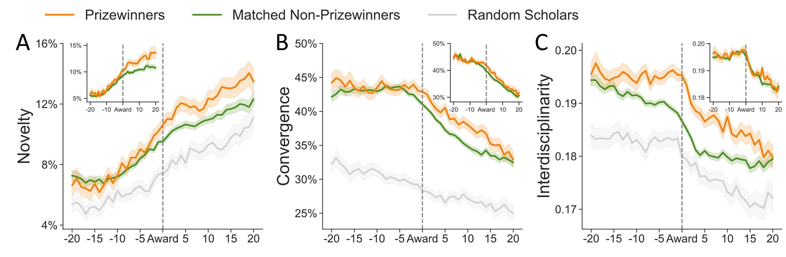

## First-Author Publications

- **Chaolin Tian**, Yurui Huang, Ching Jin, Yifang Ma, & Brian Uzzi. (2024).  
  **The Innovative Distinctiveness of Prizewinners and their Networks**.   
_arXiv preprint_. [[pdf]](https://arxiv.org/pdf/2411.12180)

<figure style="text-align: center;">
  
  <figcaption>Temporal patterns of innovativeness for prizewinners and matched non-prizewinners. 
  The figure shows how innovativeness—measured via novelty, convergence, and interdisciplinarity—rises and diverges between groups around the prizewinning year (t=0), highlighting persistent post-award differences.</figcaption>
</figure>

- **Chaolin Tian**, Xunyi Jiang, Yurui Huang, Langtian Ma, & Yifang Ma. (2024).  
  **Decoding University Hierarchy and Prestige in China through Domestic Ph.D. Hiring Network**.   
_arXiv preprint_. [[pdf]](https://arxiv.org/pdf/2401.12739)

<figure style="text-align: center;">
  
  <figcaption> Prestige hierarchy in China's faculty hiring network. 
  (Left) The distribution of unviolated edges indicates significant hierarchical structure in empirical data compared to a null model. 
  (Right) Nested stochastic block models (SBMs) reveal a clear core-periphery pattern, with the “C9 League” universities forming the central core of the hiring network.</figcaption>
</figure>

## Working papers

- **Chaolin Tian**, Fan Jiang, Yurui Huang, Cassidy R Sugimoto, & Yifang Ma. (2024).  
  **Prize Recognition Boosts Women’s Scientific Status and Career Longevity More than Men's**.   
 _Manuscript_.

- **Chaolin Tian**, Brian Uzzi, & Yifang Ma. (2025).  
  **Unveiling the Intellectual Dimensions of the Innovativeness Metrics in Science**.   
 _Manuscript_.

- **Chaolin Tian**, & Yifang Ma. (2025).  
  **The Innovation Trap of Early-Career Researchers**.   
 _Manuscript_.

## Ph.D. dissertation

- **Chaolin Tian** (2025). Statistical Analysis and Modeling of Scholar Academic Characteristics Based on Large-Scale Scientific Data.
(基于大规模科研数据的学者学术特征统计分析与建模)

## Co-Authored Publications

- Yurui Huang, **Chaolin Tian**, & Yifang Ma. (2023).  
  **Practical Operation and Theoretical Basis of Difference-in-Difference Regression in Science of Science: A Comparative Trial on the Scientific Performance of Nobel Laureates versus Their Coauthors**.     
 *Journal of Data and Information Science*, 8(1), 29–46. [[pdf]](https://www.j-jdis.com/EN/10.2478/jdis-2023-0003)

- Yurui Huang., Xunsen Cheng., **Chaolin Tian.**, Xunyi Jiang, Langtian Ma, & Yifang Ma. (2024).  
  **Talent Hat, Cross-border Mobility, and Career Development in China**.   
*Quantitative Science Studies*, 1–24. [[pdf]](https://direct.mit.edu/qss/article/5/3/516/120942)

- Yongshen He, Yurui Huang, **Chaolin Tian**, Shingbin Xiang, & Yifang Ma. (2024).  
  **Neural Embeddings of Scientific Mobility Reveal the Stratification of Institutions in China**.    
  *Information Processing & Management*, 61(3), 103702. [[pdf]](https://www.sciencedirect.com/science/article/pii/S0306457324000621)

- Yurui Huang, Zimo Wang, **Chaolin Tian**, & Yifang Ma. (2024).  
  **Community Detection on Elite Mathematicians' Collaboration Network**.    
 *Journal of Data and Information Science*, 9(4), 1–23. [[pdf]](https://www.j-jdis.com/EN/10.2478/jdis-2024-0026)

- Shing bin Xiang, Xin Jiang, Bing Liu, Yurui Huang, **Chaolin Tian** & Yifang Ma. (2025).  
  **Knowledge Navigation: Inferring the Interlocking Map of Knowledge from Research Trajectories**.    
 *Journal of the Association for Information Science and Technology.* [[pdf]](https://asistdl.onlinelibrary.wiley.com/doi/10.1002/asi.25005?af=R)

- Yurui Huang, Langtian Ma, **Chaolin Tian**, Xunyi Jiang, Roberta Sinatra, & Yifang Ma. (2024).  
  **Quantifying the Hierarchical Scales of Scientists' Mobility**.    
_arXiv preprint_. [[pdf]](https://arxiv.org/pdf/2401.06794)

